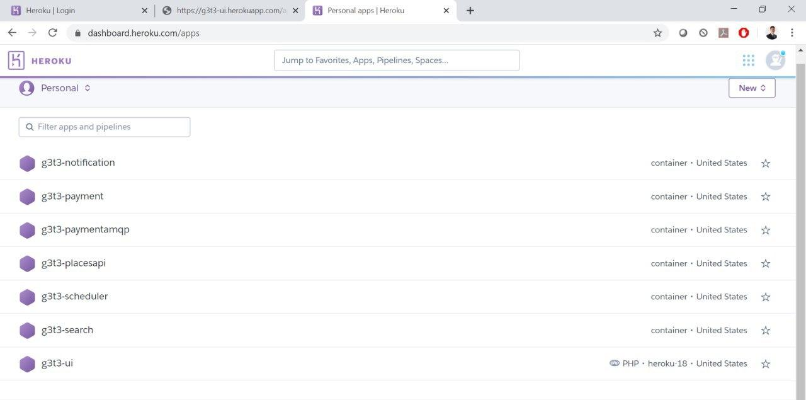
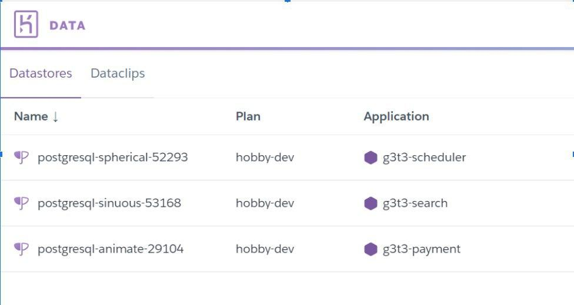
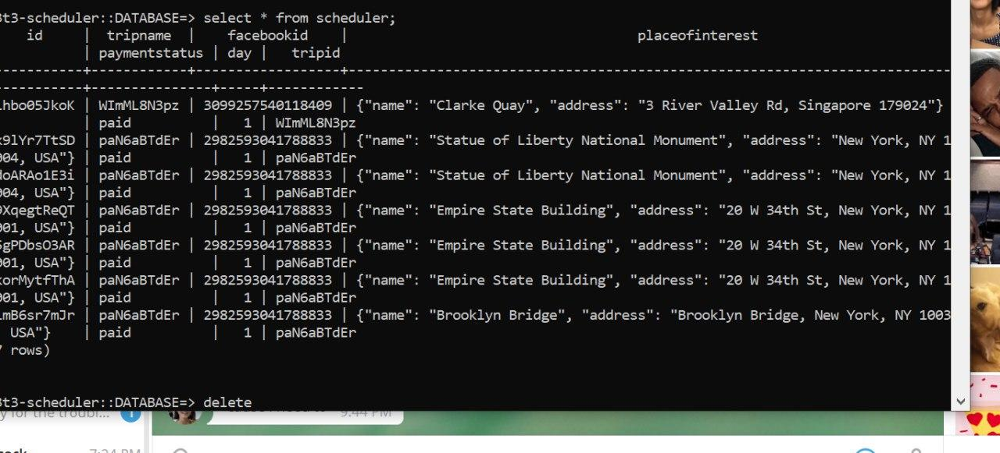
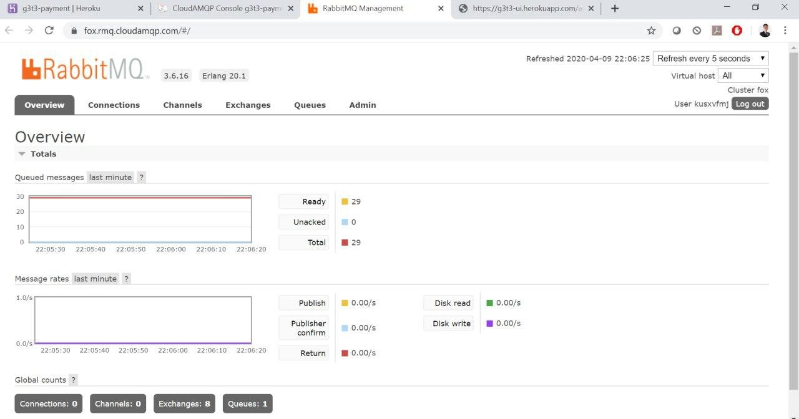

# g3t3-esd One-Stop Travel Planner


## Click [here](https://github.com/ernestkkb/g3t3-esd.git) to view our Github repository

| Student     | Email          |
| -------- | -------------- |
| Khoo Khim Boon Ernest | ernest.khoo.2018@sis.smu.edu.sg	 |
| Jaslyn Toh Lixuan | jaslyntoh.2018@sis.smu.edu.sg	 |
| Chua Wilson | wilson.chua.2018@sis.smu.edu.sg |
| Tan Chin Hoong | chtan.2018@sis.smu.edu.sg |
| Tan JiaLe Brennan | brennan.tan.2018@sis.smu.edu.sg |
| Sim Theen Cheng | tcsim.2018@sis.smu.edu.sg |

## About 
Problem: Existing travel planners are not comprehensive & customisable enough

Our Solution: One-stop online travel platform where users can plan their travel route according to their preferences


## Main Screens
1. Login page
2. Homepage (Search & Premade
3. Packages)
4. Places Of Interest (POI) page 
5. Summary page for user’s trips
6. Notification Page
7. Payment Page

## Microservices
1. Location search for countries/cities @g3t3-esd\app\search_ms\search.py
2. Scheduler @g3t3-esd\app\scheduler_ms\scheduler.py
3. Payment @g3t3-esd\app\payment_ms\paymentMS.py and paymentAMQP.py
4. Notifications@ g3t3-esd\app\notification_ms\notification.py
5. Places @g3t3-esd\app\places_ms\placesapi.py


## User Scenarios 
1. Login & Adding Package Recommendations
    * The user will login to our application via Facebook. The UI communicates with Facebook Graph API to allow users to access our application. The user can then select the premade packages shown on the UI. The UI communicates with the Scheduler Microservice to show the details of the package and allow users to add the package into their trips. 
  
2. Customising Trips & Viewing all Trips
   * Users can customise their trips by choosing a desired city, tripname, number of days via UI which communicates with Location Search Microservice. This returns a list of places of interest from the Places Microservice (Google Places API) which shows the users the details of each POI. The UI then communicates with Scheduler Microservice when the user adds the desired places of interest to the trip. When the user confirms the trip, the UI will show a page where he/she can view all his/her trips. The UI sends the user's facebook ID to the Scheduler Microservice to view all confirmed trips with its details, a view route and payment option. 
  
3. Route planning
   * Users can decide the sequence of places for each day of any trip and the UI communicates with Google Directions API to show the time taken and mapped route to travel from one place of interest to another based on the selection.
  
4. Payment & Notification
   * The UI communicates with Payment Microservice to view payment details. Payment is then done via PayPal API. Once payment is successful, the user can then receive the itinerary by submitting their emails. The UI communicates with the Notifications Microservice which communicates with Scheduler Microservice to do this. 
   

   

## Running our application
* Our application has been dockerised. It is composed and deployed on Heroku Cloud
* To use our application, simply follow this link [HerokuLink](https://g3t3-ui.herokuapp.com) 

**Python Modules used**
* flask
* flask_mail
* flask_cors
* requests
* flask_sqlalchemy
* pika
* paypalrestsdk
  
_Other dependencies not listed above may have been downloaded by the respective modules_

## Beyond the Labs

### 1. Implementation of 3rd Party APIs
* Facebook Graph API
* Google Places API
* Google Directions API
* Paypal API


### 2. Docker


* Docker was used to containerise the microservices with the relevant 

Shared requirements.txt across containers
```
blinker==1.4
certifi==2019.11.28
cffi==1.14.0
chardet==3.0.4
click==7.1.1
cryptography==2.8
dnspython==1.16.0
Flask==1.1.1
Flask-Cors==3.0.8
Flask-Mail==0.9.1
Flask-SQLAlchemy==2.4.1
idna==2.9
itsdangerous==1.1.0
Jinja2==2.11.1
joblib==0.14.1
MarkupSafe==1.1.1
mysql-connector-python==8.0.19
numpy==1.18.2
paypalrestsdk==1.13.1
pika==1.1.0
protobuf==3.6.1
psycopg2==2.8.5
pycparser==2.20
pyOpenSSL==19.1.0
requests==2.23.0
scikit-learn==0.22.2.post1
scipy==1.4.1
six==1.14.0
sklearn==0.0
SQLAlchemy==1.3.14
urllib3==1.25.8
Werkzeug==1.0.0
```
### 3. Heroku
We used Heroku to compose and host all our docker containers on the cloud. Heroku simplifies the usage of our application as it does all the heavy lifting for the user in terms of downloading dependencies, starting up individual microservices and establishing connections to the database of our application.

**Different applications hosted on heroku:** 



To leverage on the tools and services provided by Heroku which is a Platform as a service, we uploaded our docker images which are built from our microservices to form 6 standalone applications on Heroku. Out of the 6 applications, payment microservice, scheduler microservice and search microservice are attached to Heroku’s postgresql database separately. In addition, as we are implementing AMQP as an open standard protocol, we leveraged on the AMQPcloud provided by Heroku to facilitate messaging based communication between our microservices. Furthermore, AMQPcloud provides a RabbitMQ manager to help us visually track the number of messages in each queue at one time.


**Postgresql DB attached to different applications/Microservices:**



**Postgresql Database via command line:**


**RabbitMQ Manager by Heroku**
